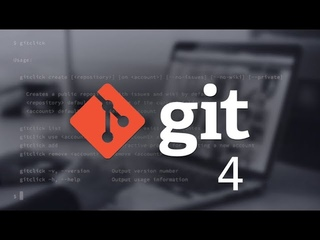

# Инструкция по работе в языком Markdown.

[Перейдите по ссылке, чтобы ознакомится с инструкцией](Instruction.md)

 

# Инструкция для работы с Git и удалёнными репозиториями  

## Что такое Git?
Git - это одна из реализаций распределённых систем контроля версий, имеющая как и локальные, так и удалённые репозитории. Является самой популярной реализацией систем контроля версий в мире.
## Подготовка репозитория
Для создание репозитория необходимо выполнить команду ***git init***  в папке с репозиторием и у Вас создаться репозиторий (появится скрытая папка .git)

## Просмотр папок и файлов в репозитории, перемещение между папками.
1. ls - посмотреть содержимое папки, в которой находишься.
2. ls -a - посмтореть все файлы (даже скрытые)
3. cd "название папки/" - переход между папками.
4. cd ../ - вернуться в предыдущую папку.

## Создание коммитов

### Git add
Для добавления измений в коммит используется команда *git add*. Чтобы использовать команду *git add* напишите *git add <имя файла>*

### Просмотр состояния репозитория
Для того, чтобы посмотреть состояние репозитория используется команда *git status*. Для этого необходимо в папке с репозиторием написать *git status*, и Вы увидите были ли измения в файлах, или их не было.

### Создание коммитов
Для того, чтобы создать коммит(сохранение) необходимо выполнить команду *git commit*. Выполняется она так: *git commit -m "<сообщение к коммиту>*. Все файлы для коммита должны быть ***ДОБАВЛЕНЫ*** и сообщение к коммиту писать ***ОБЯЗАТЕЛЬНО***.

## Перемещение между сохранениями
Для того, чтобы перемещаться между коммитами, используется команда *git checkout*. Используется она в папке с пепозиторием следующим образом: *git checkout <номер коммита>*

## Журнал изменений
Для того, чтобы посмтреть все сделанные изменения в репозитории, используется команда *git log*. Для этого достаточно выполнить команду *git log* в папке с репозиторием

## Ветки в Git

### Создание ветки

Для того, чтобы создать ветку, используется команда *git branch*. Делается это следующим образом в папке с репозиторием: *git branch <название новой ветки>*

## Слияние веток

Для того чтобы дабавить ветку в текущую ветку используется команда *git merge <name branch>*

## Удаление веток
Для удаления ветки ввести команду "git branch -d 'name branch'"

## Работа с удаленным репозиторием
git remote add origin https://github.com/DRevan95/GeekBrains-study.  git - прикрепление локального репозитория на Github.  
git push -u origin название ветки - залить на Github локальные файлы.  
git push - залить на Github изменённые фалы той же ветки.  
git pull - сохранить изменения, сделание глобальной в репозитории в локальных файлах.  
Создавать pull request желательно из новой ветки. После создание объединять с веткой master.